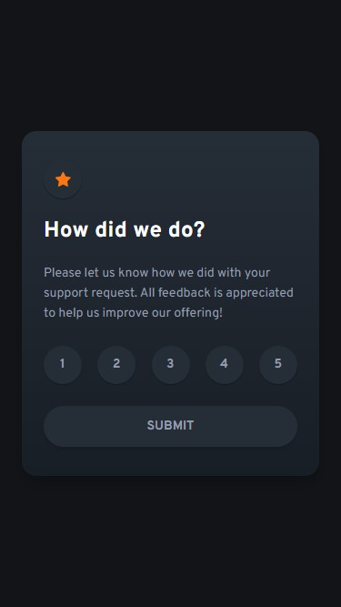
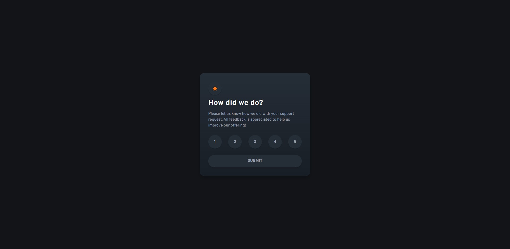
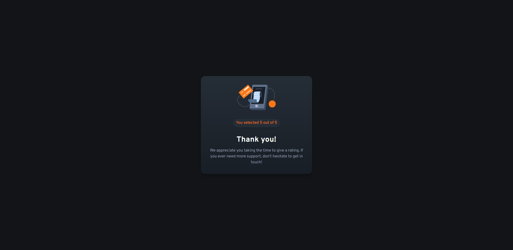

# Frontend Mentor - Interactive rating component solution

This is a solution to the [Interactive rating component challenge on Frontend Mentor](https://www.frontendmentor.io/challenges/interactive-rating-component-koxpeBUmI). Frontend Mentor challenges help you improve your coding skills by building realistic projects. 

## Table of contents

- [Overview](#overview)
  - [The challenge](#the-challenge)
  - [Screenshot](#screenshot)
  - [Links](#links)
- [My process](#my-process)
  - [Built with](#built-with)
  - [What I learned](#what-i-learned)
  - [Continued development](#continued-development)
- [Author](#author)
- [Acknowledgments](#acknowledgments)

## Overview

### The challenge

Users should be able to:
- View the optimal layout for the app depending on their device's screen size
- See hover states for all interactive elements on the page
- Select and submit a number rating
- See the "Thank you" card state after submitting a rating

### Screenshot

## Mobile design


## Mobile thank you state


## Desktop design


## Desktop thank you state


### Links

- Solution URL: [Add solution URL here](https://your-solution-url.com)
- Live Site URL: [Live Site](https://unrivaled-kleicha-c18fe9.netlify.app/)

## My process

### Built with

- [React](https://reactjs.org/) - JS library
- [Next.js](https://nextjs.org/) - React framework
- [Tailwind CSS](https://tailwindcss.com/) - For styles


### What I learned

This was the first frontend mentor project I have complepted using React and Tailwind CSS, and also my first project that was not a code-along tutorial, using the tecnhologies I mention. So, it was a great little introduction that helped me understand better, concepts like hooks and the component based architecture of React. In particular, I feel like I've gained a better understanding of the useEffect hook and also how to pass props between parent, child and sibling components.

I can say that I am proud of how I'm handling the style changes of certain components depending on their states and props pass down to them,
even though this was not a solution that I arrived at on my own, see below for an example:

```
const styles = {
    default: {
      backgroundColor: "bg-dark-blue",
      textColor: "text-light-gray",
    },
    hover: {
      backgroundColor: "bg-primary",
      textColor: "text-white",
    },
    selected: {
      backgroundColor: "bg-selected",
      textColor: "text-white",
    },
  };

  const circleStyles = {
    ...styles.default, // Merge the default styles
    ...(selected && styles.selected), // Merge the selected styles if selected is true
    ...(hover && styles.hover), // Merge the selected styles if hover is true
  };
```

### Continued development

Although I understand it a little bit better after completing this project, I am still confused about the data flow between React components and would like to explore this topic a bit further using, for example, the useContext hook.

I also need to work on my understanding of the useEffect hook, specially when and when not to use it.

## Author

- Frontend Mentor - [@duartrosar](https://www.frontendmentor.io/profile/duartrosar)

**Note: Delete this note and add/remove/edit lines above based on what links you'd like to share.**

## Acknowledgments

- [Kent C. Dodds](https://kentcdodds.com/)
- [Josh W. Comeau](https://www.joshwcomeau.com/)

